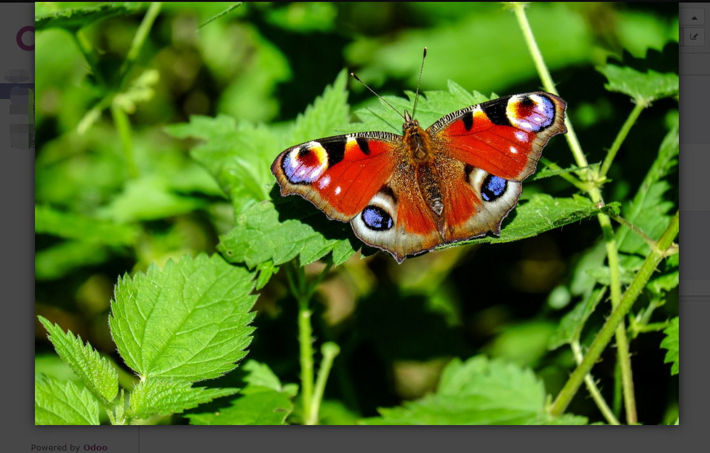

# web_image_preview
odoo web view image preview addon

# Test on:
odoo9

# How to use:

Model:
```img = fields.Binary(attachment=True)```

Tree View:
```<field name="img" widget="tree-image-preview"/>```

Form View:
```<field name="img" widget="form-image-preview"/>```

Screenshot:



